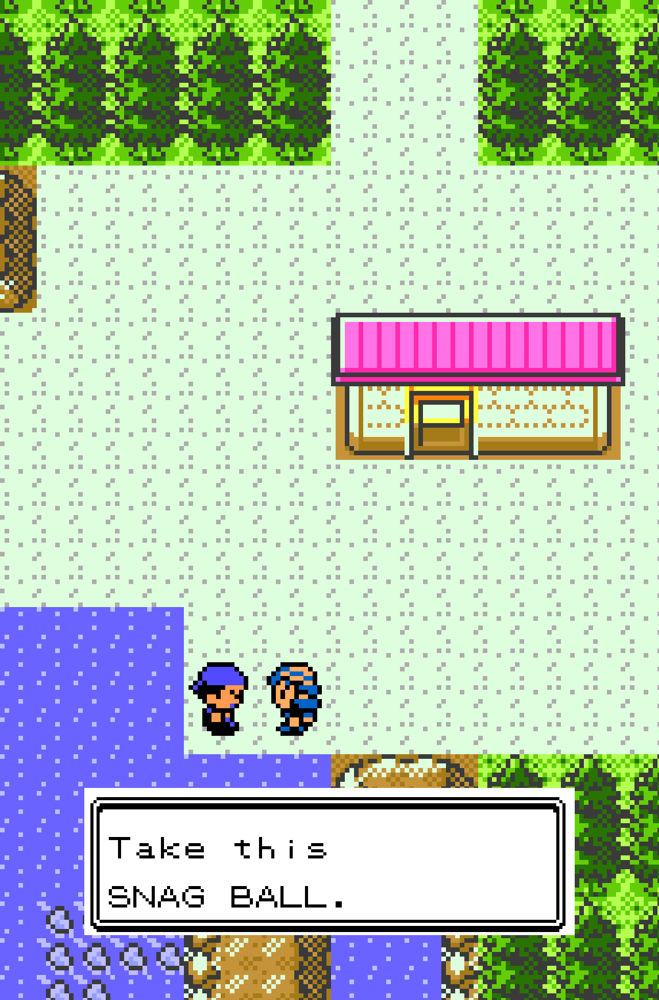
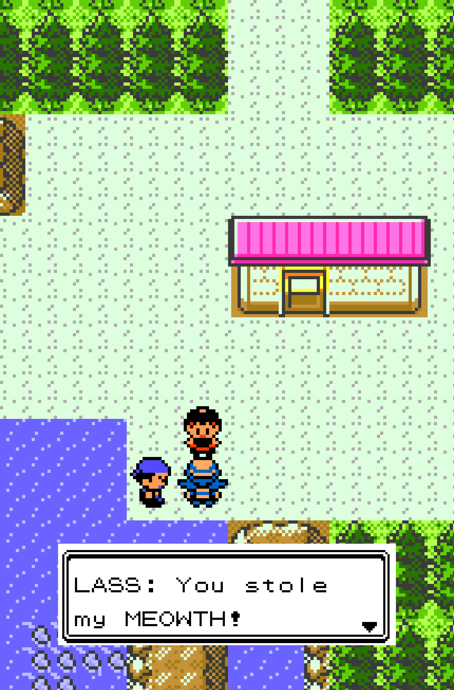
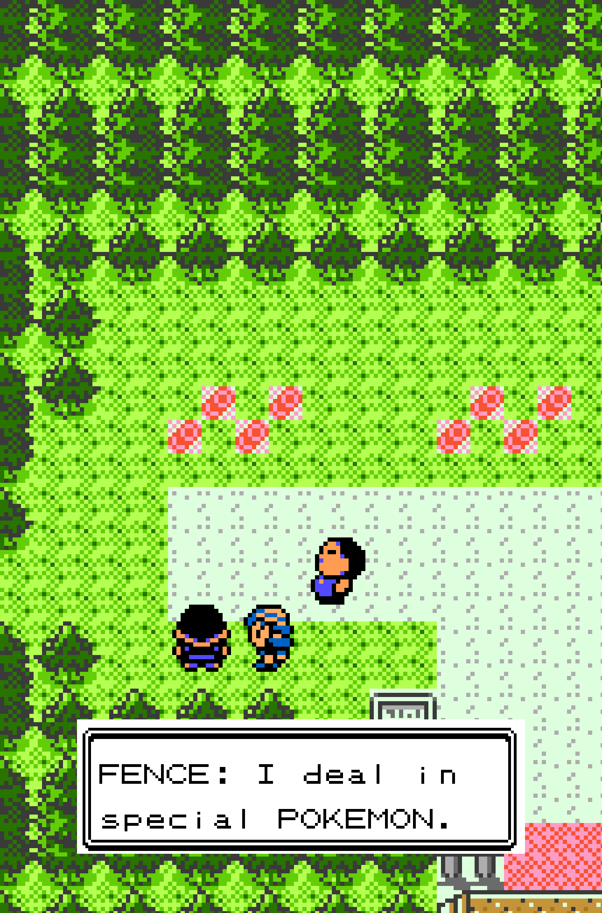
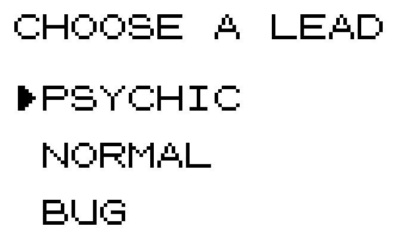
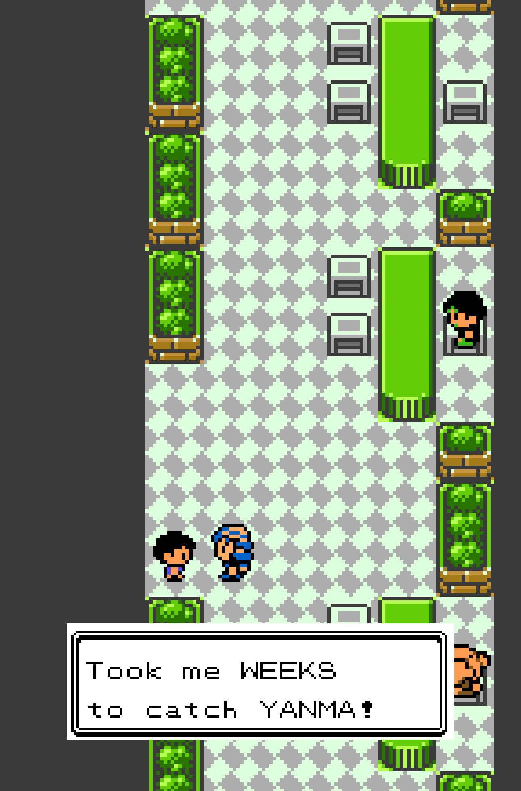
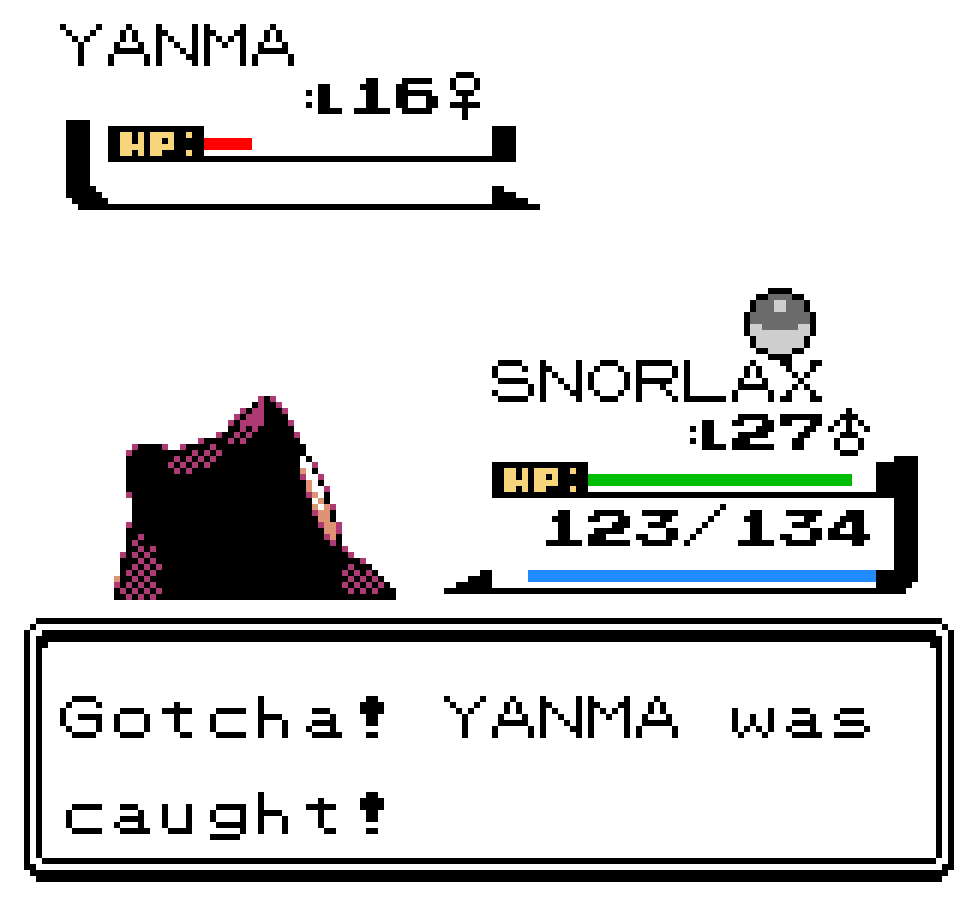
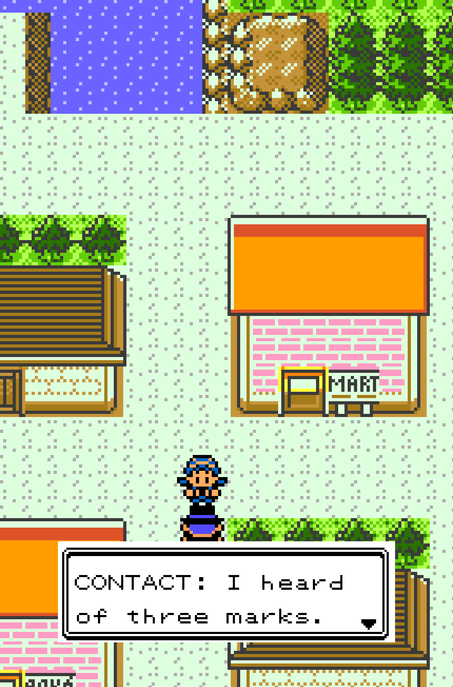

# Pokemon Snag — Steal Pokémon from Trainers

**Throw a ball at another trainer's Pokémon and take it.** Pokemon Snag
adds the Snag Ball to **Gen1ReComp++**: a real, reusable ball that works in
trainer battles, so any Pokémon an opponent sends out is a Pokémon you can
walk away with.

**On Pokémon Gold** you work your way into a black-market network — a first
ball handed over in Cherrygrove, a fence who buys what you steal, and
brokers who name a target and let you go and find it.

| | |
|---|---|
|  |  |
| It starts with one ball and a target. | It goes about as well as she expected. |
|  |  |
| A fence on Route 36 buys what you steal. | Contracts let you pick the kind of mark. |
|  |  |
| He is very proud of that Yanma. | Not any more, he isn't. |

> **Development Preview:** Pokemon Snag is in active development. Bug reports
> and feature ideas are welcome in
> [GitHub Issues](../../issues) — please include the version number from
> your load log and which other mods were enabled.

Looking for exact merchant locations, payout math or quest triggers?
Open the **[FAQ and spoiler guide](FAQ.md)** — every detailed answer is
collapsed so you only reveal what you want.

---

## The Gold questline

Johto gets its own story rather than a port of Kanto's. The mod splits on
generation at load, and the Kanto quest never runs on Gold.

**Snag Balls are not sold anywhere on Gold.** Every ball you own comes from
the questline, starting with the single one the Cherrygrove sailor hands
you.

### Cherrygrove: your first ball

A sailor gives you exactly one SNAG BALL and points you at a girl with
something unusual on her team. That one ball is guaranteed to catch her
**shiny Meowth** — the only time the mod bends its own rules. Snag it, find
him again before you leave town, and he hands over five more and tells you
where to sell what you take.

### Route 36: the fence

A fence near Sudowoodo buys Pokémon you have snagged, and only those. He
quotes a price and asks you to confirm before anything leaves your party,
and **he pays before it does**.

He is also your safety net. Turn up with no Snag Balls of any kind and
nothing he wants to buy, and he hands you one free rather than let you
waste his time — so you cannot permanently run out. He is not generous
about it.

### Goldenrod: your first contract

A broker at the Magnet Train Station offers you a lead and lets you choose
the type: **PSYCHIC**, **NORMAL** or **BUG**. Pick one and a trainer
carrying that Pokémon turns up in the Goldenrod Underground. Somewhere in
the city an ordinary passer-by is talking about having seen something
strange — they have no idea what you are, and they are telling you where to
look.

This is the first real job: no free ball, no guaranteed catch. Knock the
target out and you have not failed — the mark comes back so you can try
again. Snag it and the contract is done.

### Ecruteak: pick your risk



The second contract asks a different question — not which Pokémon, but what
kind of person is carrying it:

- **PERFORMER** — the easier party, at the Dance Theater
- **MYSTIC** — a three-strong Ghost party, over by the Burned Tower
- **COLLECTOR** — rarer, stronger, out by the west gate

A neutral resident gossips about something odd they have seen, which points
you at the mark. Only the advertised target completes the job, but the rest
of their team is fair game.

Finish it and go back, and the contact hands you a **HEIST BALL** — twice
as reliable as a plain Snag Ball. It is not sold anywhere and no fence will
trade for one.

### What a job is worth

Contract targets are **bounties**: the mark you were sent for fences for at
least 3 Snag Balls rather than the going rate for casual theft, and
finishing a contract pays a flat **5** on top. The rest of a mark's team is
fair game, but only the advertised target carries the bounty.

Once they have paid you, **both contacts start buying** — the Goldenrod
broker directly, and the Ecruteak contact in a colder voice and at a higher
level. Same rules either way: your last Pokémon is never sellable, and the
payment always lands before the Pokémon leaves.

## How snag payouts work

No sale pays less than 2 Snag Balls — giving up a Pokémon is permanent, and
one ball back could not even repeat the throw that caught it. On top of that
floor come bonuses for high level, hard-to-catch species and VIP victims,
capped at 5. A quest mark never pays less than 3. Exact thresholds are in
the [FAQ](FAQ.md) behind a spoiler fold.

**This applies on both games** — Red and Gold share one valuation.

## Installation

1. Download `snag_quest-<version>.zip` from the
   [latest release](../../releases/latest).
2. In the launcher: **MODS → Import mod .zip**. On iOS, delete any older
   downloaded copy of the zip from Files first.
3. Fully quit and relaunch.

Requires gen1recomp **0.1.38 or newer** for Red, Blue and Yellow, and
**0.1.78 or newer** for Gold — that is the release Gen 2 support arrived
in. Nothing else is mandatory.

**Updating:** once installed, the launcher checks this repo for new
releases. The mod's entry shows "vX.Y.Z available" → tap → **Update** →
fully quit and relaunch. No manual re-download.

After installing an update, **fully quit and relaunch** the game. The load
log prints the running version so you can confirm what's live.

## Compatibility

- **[Pokéball Colors](https://github.com/mistermiracle3036/Pokeball-Colors)** —
  optional. On **Red, Blue and Yellow** it paints the Snag Ball's throw in
  Team Rocket black and red; this mod hands it those colours at startup, so
  there is nothing to set up.
- **[Too Many Balls](https://github.com/mistermiracle3036/Too-Many-Balls)** —
  optional, and worth having on Gold. Gold's Ball pocket is small and this
  mod adds two more ids to it, so Pokemon Snag asks Too Many Balls for two
  slots of extra headroom when it is installed. Without it nothing breaks —
  the pocket is simply tighter, and if a reward will not fit, whoever owes
  it keeps that half until you have made room.

  Its **Ball Case** tidies away its own balls, which is the quickest way to
  stop scrolling past a dozen of them. Your Snag Balls stay in the pocket
  rather than going into the case — each mod's balls stay with that mod —
  so the ones you actually throw mid-battle are still where you left them.
- **[Ribbons](https://github.com/mistermiracle3036/Ribbons)** — supported.
  Reads the snag marker on stolen Pokémon and awards a ribbon.
- **It sits quietly beside other mods on Gold.** Everyone this mod adds in
  Johto — the sailor, the fence, the brokers, the marks — is its own
  character placed at runtime, not a vanilla NPC rewritten. So it does not
  compete with another mod for the same townsfolk, and nothing it adds can
  be silently overwritten by one.

---

## Also on Red, Blue and Yellow

Kanto has its own separate questline, and it is still here — nothing about
it changed when Gold arrived.

A **Team Rocket recruiter** at the end of Nugget Bridge brings you into the
business. Beat him, then hear him out: he sets you up with your first Snag
Ball and a target, a Picnicker with a very special Meowth. The snag is
guaranteed, and so is a surprise about that Meowth. Say no and the offer
stays open — come back any time.

From there, **four fences** around Kanto quietly buy snagged Pokémon,
paying **2–5 Snag Balls** depending on the mon's level, rarity and who you
stole it from. VIP targets — a certain rival, gym leaders, the Elite Four —
fetch top price. They are not one organisation: two are Rocket, two are
independents who simply like what falls off the back of a truck, and they
each have their own opinion of you.

**Red, Blue and Yellow are all supported.** Where an NPC's internal name
differs between versions, both names are registered. Every NPC this mod
takes over was checked against the engine's Red and Yellow symbol tables:
the Nugget Bridge recruiter, the Pewter fence and the Vermilion fence are
identical across versions; the Celadon fence genuinely differs, so that one
ships both names.

### Other mods in Kanto

Unlike the Gold questline, the Kanto one works by **taking over specific
vanilla characters**. If another mod claims the same character, only one of
them wins and the other's dialogue silently never runs — that is how the
engine resolves the conflict, not a bug in either mod. If a fence only ever
gives their ordinary line, try disabling other NPC-editing mods to see which
one is winning. (Team Rocket Returns was tested alongside this mod and does
**not** conflict.)

**[quest_system](https://github.com/FAFF0x/gen1recomp)** by FAFF0x —
optional, and Kanto only. With it, the questline appears in the journal with
an objective, progress and map markers. Without it the quest plays
identically — it runs on its own save flags — you simply get no journal
entry. Grab `quest_system_v<version>.zip` from that repo's file list; it is
committed there rather than released, so the launcher's auto-update will not
cover it.

**[Shiny Pokémon](https://github.com/masterwebx/gen1recomp-shiny-pokemon)** —
optional, and only relevant here: Gold renders shiny Pokémon itself, so
nothing extra is needed there. In Kanto the division of labour matters —
**this mod supplies the data, that mod supplies the picture.** The quest
Meowth's shiny DVs are set here and are engine-native (`Stats.isShiny`), so
it is genuinely shiny whether or not that mod is installed. Every *visual* —
the ◆ marker beside the name, the sparkle on send-out — is drawn entirely by
Shiny Pokémon. Turning it off leaves the Meowth just as shiny, only
undecorated. Its marker and its recolour are separate options, so a Meowth
showing the ◆ but the wrong colour means **SHINY COLORS** is switched off.

### Options — Red, Blue and Yellow only

Open **MODS → POKEMON SNAG → OPTIONS** (F10 mod manager). **The Gold
questline has no settings**, and the battle always continues after a snag
there.

| Option | Default | Effect |
| ------ | ------- | ------ |
| CONTINUE BATTLE AFTER SNAG | ON | Trainer battles continue after a successful snag instead of ending |
| GET NEW SNAG BALLS | BOTH | Where Snag Balls come from after the quest: `BOTH`, `MART` (₽10,000 each) or `FENCES` |
| [DEV] REPLAY INTRO QUEST | OFF | Dev/testing toggle — lets you redo *Introduction to Thievery* |

## For modders

If you're building on this, [DEVELOPMENT.md](DEVELOPMENT.md) documents the
engine internals this mod touches and the reasoning behind them — the
trainer-battle ball gate, the faint-pipeline handoff, and the
`mon.snagged` / `mon.snagFrom` / `mon.snagLevel` fields other mods can read.

### Custom trainer VIP compatibility (Gold)

Pokemon Snag exposes a `snag.vip` hook for mods that add important custom
trainers. The hook receives the built-in VIP verdict plus encounter context
and may return `true` to mark that trainer as VIP for fence valuation. The
verdict is stamped onto the stolen Pokémon as `mon.snagVip`, so the bonus
stays stable later even if the other mod is disabled.

```lua
mod.hooks:wrap("snag.vip", function(next_, vip, ctx)
  vip = next_(vip, ctx)
  if ctx.npc and ctx.npc.def and ctx.npc.def.name == "MY_CUSTOM_BOSS" then
    return true
  end
  return vip
end)
```

`ctx` includes `game`, `world`, `npc`, `mapId`, `trainerClass`, `classIndex`,
`trainerName`, `memberIndex`, `trainerEvent`, and `sight`.

## Credits

Built for [gen1recomp](https://github.com/bryanthaboi/gen1recomp).
By **Mister Miracle**
([@mistermiracle3036](https://github.com/mistermiracle3036)).

The Nugget Bridge opening was **trikus's** idea, suggested in the
gen1recomp Discord: instead of inventing a character to hand out the
quest, use the Team Rocket grunt who already asks whether you want to
join — and let saying yes actually mean something. Vanilla asks the
question and then ignores your answer, so the hook was already there.
It replaced an earlier opening built around the Viridian City girl.

Licensed under [MIT](LICENSE). See
[THIRD_PARTY_NOTICES.md](THIRD_PARTY_NOTICES.md).
